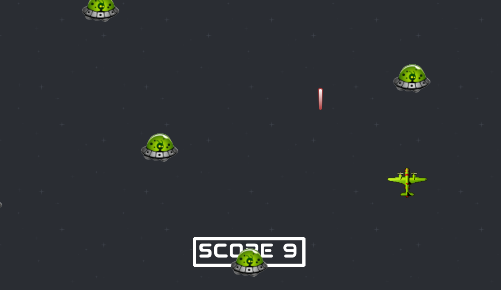

# 👾 Alien Attack Game 🚀



Alien Attack is a simple 2D arcade game made with **Python** and **Pygame**.  
Control your spaceship and shoot lasers to destroy incoming aliens! 🛸💥

---

## ✨ Features

- 👽 Randomly spawning aliens moving downward with varied horizontal directions  
- 🚀 Player spaceship controlled by mouse/keyboard (customizable)  
- 🔫 Laser shooting with cooldown and sound effects  
- 🎮 Basic gameplay mechanics, easy to extend  
- 🎨 Includes images and sounds assets

---

## ⚙️ Installation

1. **Clone the repo:**

```bash
git clone https://github.com/Kyara0797/Alien-Attack-Game.git
cd Alien-Attack-Game
```

2. **Create and activate a virtual environment:**

python -m venv env
# Windows
env\Scripts\activate
# macOS/Linux
source env/bin/activate

3. **Install dependencies:**

pip install -r requirements.txt

▶️ **How to Run**
Run the game with:
python main.py

📦 **Project Structure**

Alien-Attack-Game/
├── images/ # Game images and sprites
├── sounds/ # Sound effects and music
├── paquete/ # Game modules (AlienManager, LaserManager, Ship, etc.)
├── main.py # Main game script
├── requirements.txt # Python dependencies
├── README.md # This file
└── .gitignore # Git ignore rules
